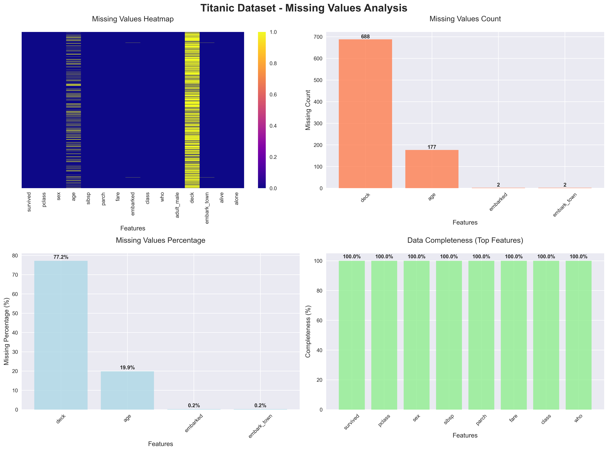
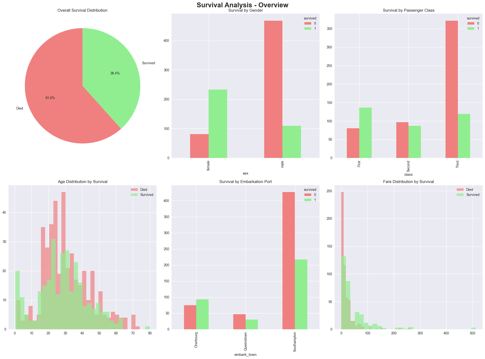
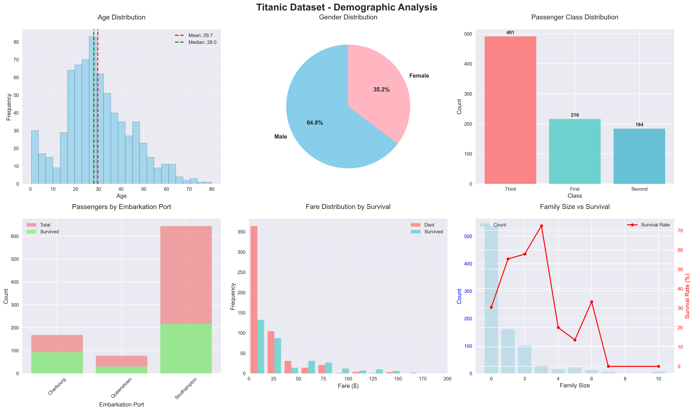
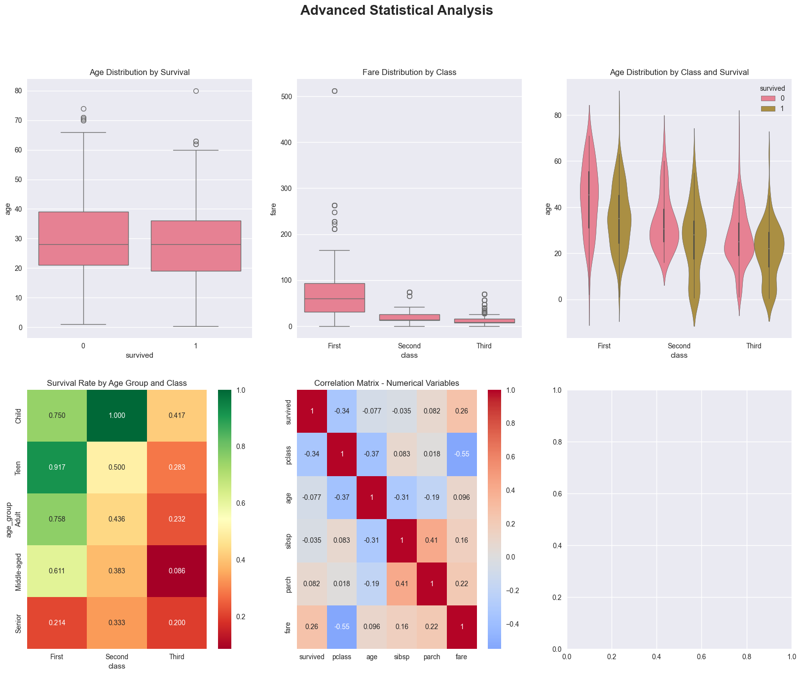

# 🚢 Titanic Dataset - Comprehensive Exploratory Data Analysis (EDA)


## 📋 Table of Contents
- [Project Overview](#-project-overview)
- [Dataset Information](#-dataset-information)
- [Key Findings](#-key-findings)
- [Installation](#-installation)
- [Usage](#-usage)
- [Visualizations](#-visualizations)
- [Statistical Analysis](#-statistical-analysis)
- [Project Structure](#-project-structure)
- [Results](#-results)
- [License](#-license)

## 🎯 Project Overview

This project provides a comprehensive exploratory data analysis (EDA) of the famous Titanic disaster dataset. The analysis includes detailed statistical examination, extensive visualizations, hypothesis testing, and pattern recognition to understand the factors that influenced passenger survival rates.

### Objectives
- 📊 Perform complete statistical analysis of passenger demographics
- 🔍 Identify key factors influencing survival rates
- 📈 Create comprehensive visualizations for data insights
- 🧪 Conduct statistical hypothesis testing
- 📋 Generate actionable insights from the disaster data

## 📊 Dataset Information

The Titanic dataset contains information about passengers aboard the RMS Titanic, which sank on April 15, 1912.

### Dataset Specifications
- **Source**: Seaborn built-in dataset
- **Total Passengers**: 891
- **Features**: 15 columns
- **Target Variable**: `survived` (0 = No, 1 = Yes)

### Features Description
| Column | Description | Type |
|--------|-------------|------|
| survived | Survival status (0 = No, 1 = Yes) | int |
| pclass | Ticket class (1 = 1st, 2 = 2nd, 3 = 3rd) | int |
| sex | Gender | object |
| age | Age in years | float |
| sibsp | Number of siblings/spouses aboard | int |
| parch | Number of parents/children aboard | int |
| fare | Passenger fare | float |
| embarked | Port of embarkation (C = Cherbourg, Q = Queenstown, S = Southampton) | object |
| class | Passenger class | object |
| who | Person category (man, woman, child) | object |
| adult_male | Whether adult male | bool |
| deck | Deck level | object |
| embark_town | Embarkation town | object |
| alive | Survival status (yes/no) | object |
| alone | Whether traveling alone | bool |

## 🔍 Key Findings

### Survival Statistics
- **Overall Survival Rate**: 38.4% (342 survivors out of 891 passengers)
- **Total Casualties**: 549 passengers
- **Gender Gap**: Women had 3.9x higher survival rate than men

### Demographic Insights
| Factor | Survival Rate | Key Insight |
|--------|---------------|-------------|
| **Female** | 74.2% | "Women and children first" policy |
| **Male** | 18.9% | Significantly lower survival |
| **1st Class** | 62.9% | Higher socioeconomic status advantage |
| **2nd Class** | 47.3% | Moderate survival rate |
| **3rd Class** | 24.2% | Lower deck location disadvantage |
| **Children (≤12)** | 57.9% | Prioritized in evacuation |
| **Adults (>12)** | 36.6% | Lower priority in evacuation |

### Statistical Significance
- **Gender vs Survival**: Highly significant (p < 0.001)
- **Class vs Survival**: Highly significant (p < 0.001)
- **Age Impact**: Significant difference between survivors and non-survivors
- **Fare Impact**: Significant correlation with survival

## 🛠️ Installation

### Prerequisites
```bash
Python 3.7+
```

### Required Libraries
```bash
pip install pandas numpy matplotlib seaborn scipy plotly warnings
```

### Alternative Installation
```bash
pip install -r requirements.txt
```

## 🚀 Usage

### Basic Usage
```python
# Clone the repository
git clone https://github.com/AbirBanerjee1223/celebal-3-titanic_visualization.git
cd celebal-3-titanic_visualization

# Run the analysis
jupyter notebook titanic_eda.ipynb
```


## 📈 Visualizations

The analysis generates 20+ comprehensive visualizations:

### 1. Missing Values Analysis

- Heatmap of missing data patterns
- Missing value counts and percentages
- Data completeness assessment

### 2. Survival Overview

- Overall survival distribution
- Survival by gender, class, and age
- Demographic breakdown of survivors

### 3. Demographic Analysis

- Age distribution with survival overlay
- Class and gender distributions
- Embarkation port analysis

### 4. Statistical Visualizations

- Box plots for age and fare by survival
- Violin plots showing distribution shapes
- Correlation heatmap for numerical variables


## 🧪 Statistical Analysis

### Hypothesis Tests Conducted

#### 1. Chi-Square Tests
- **Gender vs Survival**: χ² = 260.717, p < 0.001
- **Class vs Survival**: χ² = 102.889, p < 0.001
- **Result**: Both factors significantly associated with survival

#### 2. T-Tests
- **Age Difference**: Significant difference in mean age between survivors and non-survivors
- **Fare Difference**: Significant difference in fare paid between groups

#### 3. Correlation Analysis
- **Strongest Correlation**: Class vs Survival (r = -0.338)
- **Age vs Survival**: Weak negative correlation
- **Fare vs Survival**: Moderate positive correlation


## 📁 Project Structure

```
celebal-3-titanic_visualization/
│
├── titanic_eda.ipynb          # Main analysis script
├── README.md               # Project documentation
├── requirements.txt        # Python dependencies
├── images/                 # Generated visualizations
│   ├── missing_values_analysis.png
│   ├── survival_overview.png
│   ├── demographic_analysis.png
│   ├── statistical_analysis.png

```

## 📊 Results

### Executive Summary

The analysis reveals that survival on the Titanic was **not random** but heavily influenced by:

1. **Gender** (most significant factor)
   - Women: 74.2% survival rate
   - Men: 18.9% survival rate

2. **Passenger Class** (socioeconomic status)
   - 1st Class: 62.9% survival rate
   - 2nd Class: 47.3% survival rate
   - 3rd Class: 24.2% survival rate

3. **Age** (children prioritized)
   - Children (≤12): 57.9% survival rate
   - Adults (>12): 36.6% survival rate


## 📄 License

This project is licensed under the MIT License - see the [LICENSE](LICENSE) file for details.

